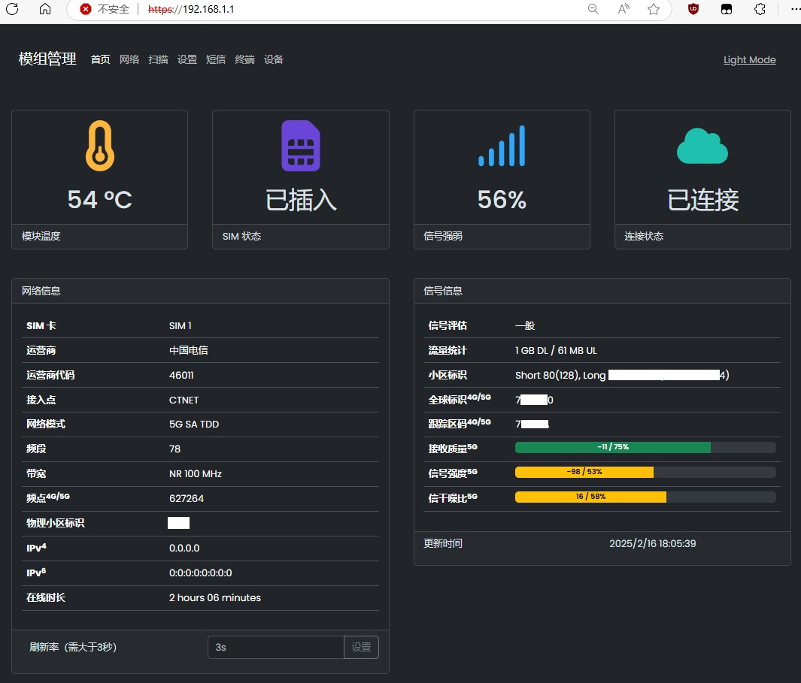
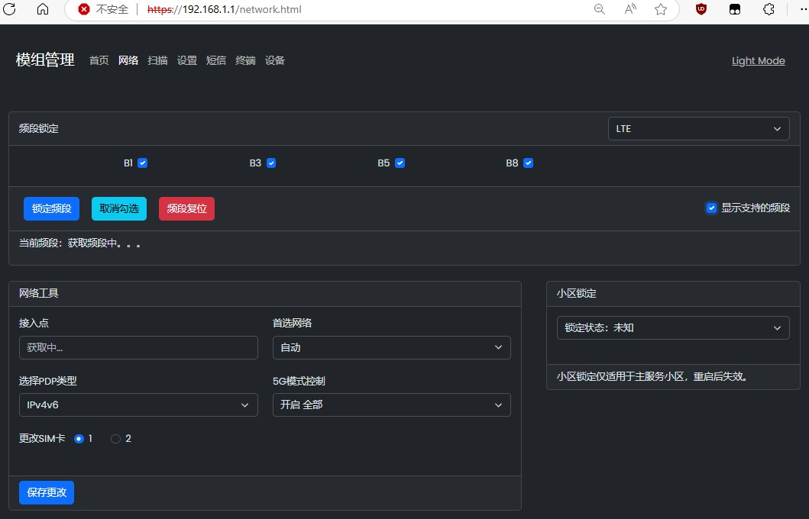
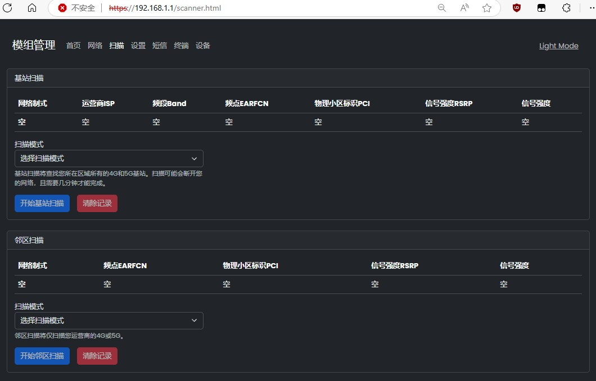
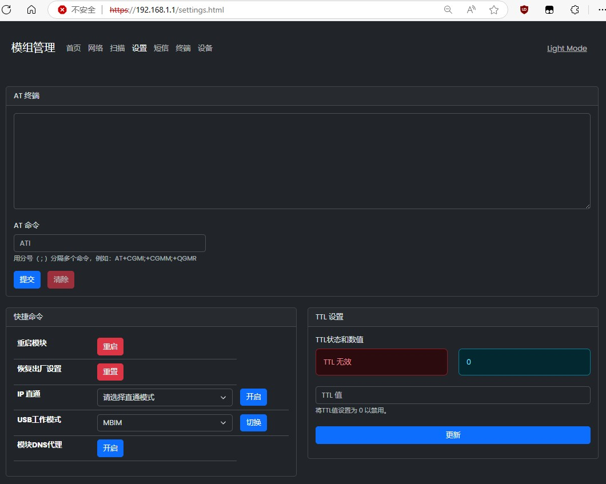
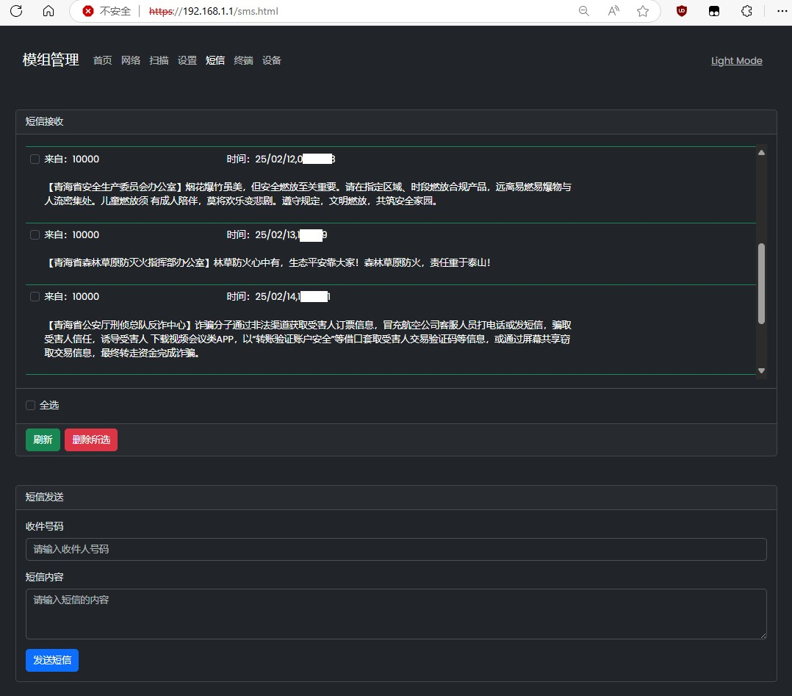
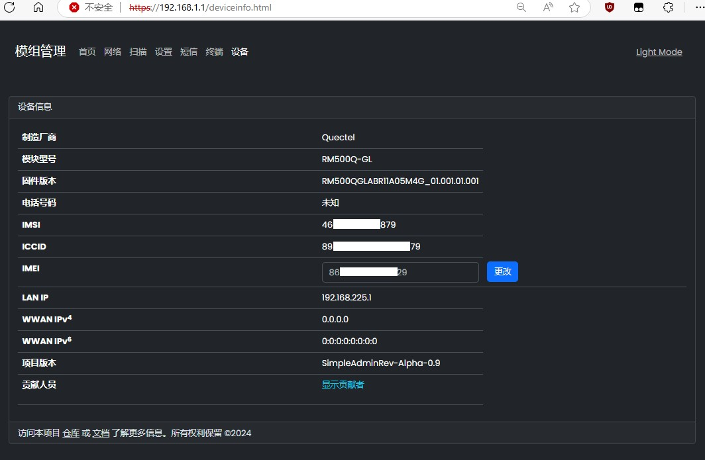

# 项目功能

1. 本项目取自[quectel-rgmii-toolkit项目](https://github.com/iamromulan/quectel-rgmii-toolkit/tree/SDXLEMUR)，由[leux汉化和优化](https://github.com/leux0/simpleadmin)

2. 上述 quectel-rgmii-toolkit 项目是将WebUI刷入到5G模块中执行，而本项目是在5G模块插入的设备上执行

3. 移远RM500Q-GL模块可在Debian等Linux系统下，通过本WebUI向AT端口 `/dev/ttyUSB*` 获取信息及执行指令

4. 理论上支持大部分移远5G模块，实际请自行测试或修改AT命令适配


# 部署项目

```bash
# 本项目依赖 bash 和 busybox 中的 microcom 命令
sudo apt install bash busybox                          # 安装依赖
git clone https://github.com/leux0/simpleadmin.git     # 获取项目
chmod +x simpleadmin/www/cgi-bin/*                     # 添加权限
busybox httpd -h ./simpleadmin/www/ -p 8080 -f         # 运行服务


# 如你安装的 busybox 没有 microcom 和 httpd 命令，也可用本项目提供的
cp simpleadmin/other/busybox-arm64-static /bin
chmod +x /bin/busybox-arm64-static

# 然后再修改 www/cgi-bin/get_atcommand 中第22行中的为带该命令的busybox
......
        runcmd=$(echo -en "$x\r\n" | busybox-arm64-static microcom -t $wait_time /dev/ttyUSB2)
......

# 最后运行WEB服务器即可访问：http://192.168.1.1:8080
busybox-arm64-static httpd -h ./simpleadmin/www/ -p 8080 -f

```


# 界面展示

1. **首页**


2. **网络**


3. **扫描**


4. **设置**


5. **短信**


6. **设备**


