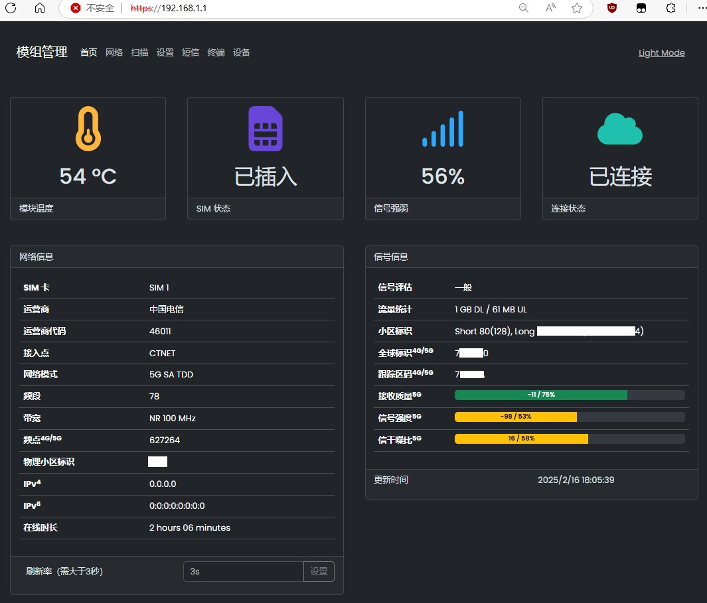
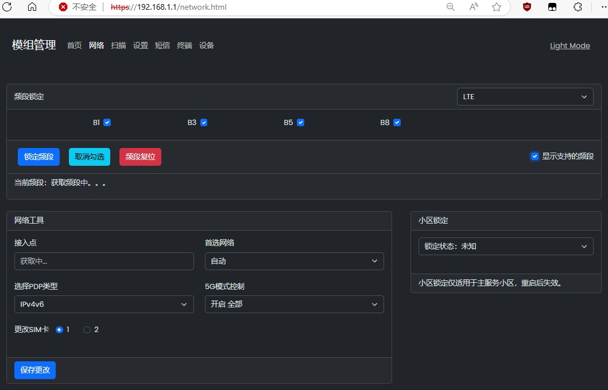
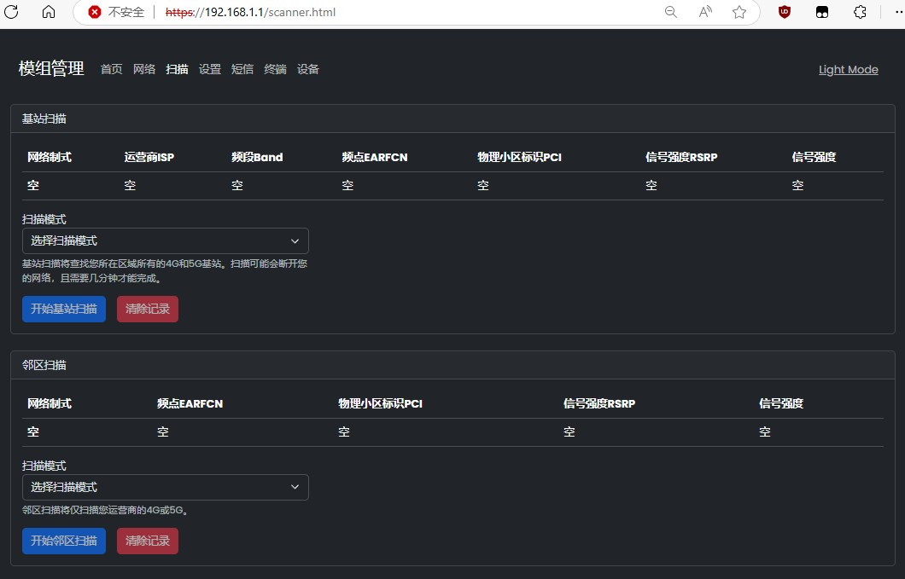
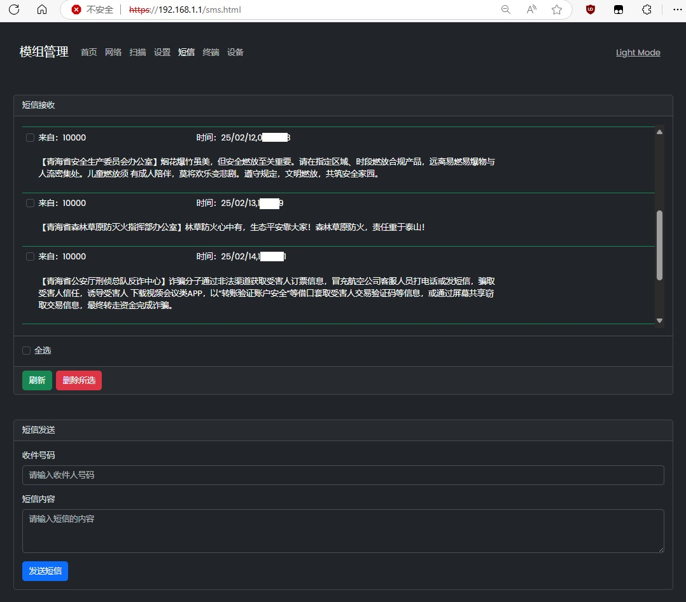
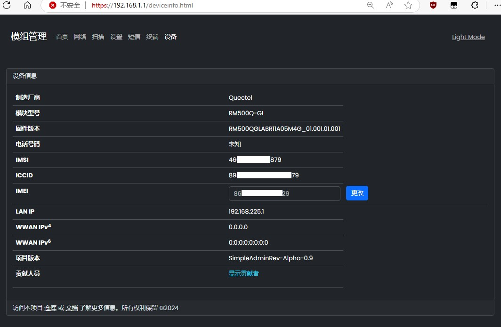

# 项目功能

1. 本项目取自[quectel-rgmii-toolkit项目](https://github.com/iamromulan/quectel-rgmii-toolkit/tree/SDXLEMUR)，由[leux汉化和优化](https://github.com/leux0/simpleadmin)

2. 移远RM500Q-GL等模块在Debian等系统下，通过本WebUI向AT端口 `/dev/ttyUSB*` 获取信息及执行指令

3. 理论上支持大部分移远5G模块，实际请自行测试或适配


# 部署项目

```bash
# 在Debian上安装所需软件并部署
sudo apt install lighttpd lighttpd-mod-openssl busybox
git clone https://github.com/leux0/simpleadmin.git
sudo cp -r simpleadmin/www/* /var/www/


# 如下可快速新增用户：用户名：admin 密码：12345678
sudo sh -c 'echo "admin:\$apr1\$wSTAv.eo\$grYX5hY0SGXODXMuuHo/o/" > /etc/lighttpd/.htpasswd'

# 如果想要改为其他用户，可安装 apache2-utils 包后执行如下命令添加
sudo /usr/bin/htpasswd -c /etc/lighttpd/.htpasswd [UserNmae]


# 生成密钥供Lighttpd的HTTPS使用
openssl genrsa -out server.key						        # 生成私钥待用
openssl req -new -key server.key -out server.csr	                        # 生成证书签名请求CSR
openssl x509 -req -days 365 -in server.csr -signkey server.key -out server.crt	# 使用CSR和私钥生成自签名证书
sudo cp server.key server.crt /etc/lighttpd/


# 配置文件 /etc/lighttpd/lighttpd.conf 的修改
server.username = "www-data"						        # 还要将这个用户名改成www目录的拥有者
server.document-root = "/var/www"
auth.backend.htpasswd.userfile = "/etc/lighttpd/.htpasswd"                      # 上面包含用户名密码的文件

ssl.privkey= "/etc/lighttpd/server.key"                                         # 上面生成的私钥
ssl.pemfile= "/etc/lighttpd/server.crt"                                         # 如上自签名证书


# 为cgi脚本添加执行权限，运行网页服务器
cd /var/www/cgi-bin/ && chmod +x ./*
/usr/sbin/lighttpd -D -f /etc/lighttpd/lighttpd.conf

```


# 配置TTYD

```bash
1. 安装运行TTYD

sudo wget -O /usr/local/bin/ttyd https://github.com/tsl0922/ttyd/releases/download/1.7.7/ttyd.aarch64
sudo chmod +x /usr/local/bin/ttyd

2. 配置 lighttpd.conf 来处理代理到TTYD

$HTTP["url"] =~ "(^/console)" {
  proxy.header = ("map-urlpath" => ( "/console" => "/" ), "upgrade" => "enable" )
  proxy.server  = ( "" => ("" => ( "host" => "127.0.0.1", "port" => 8080 )))
}

3. 添加TTYD开机启动服务

sudo cat > /etc/systemd/system/ttyd.service << EOF
[Unit]
Description=TTYD Service
After=network.target

[Service]
Type=simple
ExecStartPre=/bin/sleep 5
ExecStart=/usr/local/bin/ttyd -i 127.0.0.1 -p 8080 -t 'theme={"foreground":"white","background":"black"}' -t fontSize=25 --writable /bin/login
Restart=on-failure

[Install]
WantedBy=multi-user.target
EOF

```


# 配置讲解

```bash
# /etc/lighttpd/lighttpd.conf
server.modules = (
    "mod_redirect",              # 重定向
    "mod_cgi",
    "mod_proxy",                 # 反向代理
    "mod_openssl",               # HTTPS
    "mod_authn_file",            # 认证需要
)

server.username = "www-data"
server.groupname = "dialout"

server.bind = "0.0.0.0"
server.port = 80
server.document-root = "/var/www"
index-file.names = ( "index.html" )

auth.backend = "htpasswd"                                      # 1.可单独注释这几行来关闭认证
auth.backend.htpasswd.userfile = "/etc/lighttpd/.htpasswd"     # 1.可单独注释这几行来关闭认证

$SERVER["socket"] == "0.0.0.0:443" {                           # 2.可单独注释这几行可关闭IPv4的HTTPS
    ssl.engine = "enable"                                      # 2.可单独注释这几行可关闭IPv4的HTTPS
    ssl.privkey= "/etc/lighttpd/server.key"                    # 2.可单独注释这几行可关闭IPv4的HTTPS
    ssl.pemfile= "/etc/lighttpd/server.crt"                    # 2.可单独注释这几行可关闭IPv4的HTTPS
    ssl.acme-tls-1 = "/etc/simpleadmin/dehydrated/tls-alpn-01" # 2.可单独注释这几行可关闭IPv4的HTTPS
    ssl.openssl.ssl-conf-cmd = ("MinProtocol" => "TLSv1.2")    # 2.可单独注释这几行可关闭IPv4的HTTPS
    auth.require = ( "/" => (                                  # 1.可单独注释这几行来关闭认证
      "method" => "basic",                                     # 1.可单独注释这几行来关闭认证
      "realm" => "Authorized users only",                      # 1.可单独注释这几行来关闭认证
      "require" => "valid-user"                                # 1.可单独注释这几行来关闭认证
      )                                                        # 1.可单独注释这几行来关闭认证
    )                                                          # 1.可单独注释这几行来关闭认证
}

$SERVER["socket"] == "[::]:4443" {                             # 2.可单独注释这几行可关闭IPv6的HTTPS
    ssl.engine = "enable"                                      # 2.可单独注释这几行可关闭IPv6的HTTPS
    ssl.privkey= "/etc/lighttpd/server.key"                    # 2.可单独注释这几行可关闭IPv6的HTTPS
    ssl.pemfile= "/etc/lighttpd/server.crt"                    # 2.可单独注释这几行可关闭IPv6的HTTPS
    ssl.acme-tls-1 = "/etc/simpleadmin/dehydrated/tls-alpn-01" # 2.可单独注释这几行可关闭IPv6的HTTPS
    ssl.openssl.ssl-conf-cmd = ("MinProtocol" => "TLSv1.2")    # 2.可单独注释这几行可关闭IPv6的HTTPS
    auth.require = ( "/" => (                                  # 1.可单独注释这几行来关闭认证
      "method" => "basic",                                     # 1.可单独注释这几行来关闭认证
      "realm" => "Authorized users only",                      # 1.可单独注释这几行来关闭认证
      "require" => "valid-user"                                # 1.可单独注释这几行来关闭认证
      )                                                        # 1.可单独注释这几行来关闭认证
    )                                                          # 1.可单独注释这几行来关闭认证
}

# 重定向http到https
$HTTP["scheme"] == "http" {                                    # 3.可单独注释这几行来关闭HTTP跳转HTTPS
    url.redirect = ("" => "https://${url.authority}${url.path}${qsa}")  # 3.可单独注释这几行来关闭HTTP跳转HTTPS
}                                                              # 3.可单独注释这几行来关闭HTTP跳转HTTPS

# 位于 /cgi-bin下的可运行
$HTTP["url"] =~ "/cgi-bin/" {
    cgi.assign = ( "" => "" )
}

# 反向代理TTYD，不需要可注释掉这段
$HTTP["url"] =~ "(^/console)" {
  proxy.header = ("map-urlpath" => ( "/console" => "/" ), "upgrade" => "enable" )
  proxy.server  = ( "" => ("" => ( "host" => "127.0.0.1", "port" => 8080 )))
}

```


# 界面展示

1. **首页**


2. **网络**


3. **扫描**


4. **设置**


5. **短信**


6. **设备**


